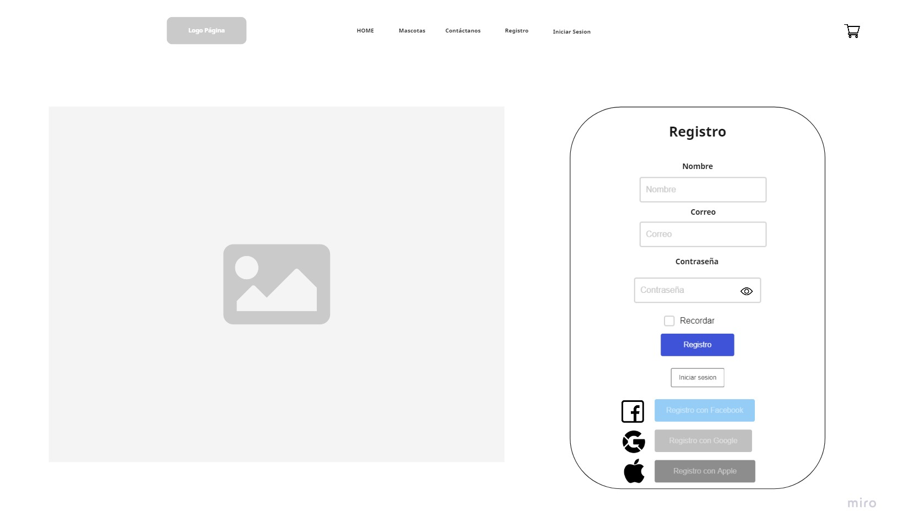

# Adopcion-animales
Nombre del proyecto.

¿En que consiste?
El proyecto consiste en brindar mediante un sitio web dedicado a facilitar la adopción de las mascotas(perros, gatos, conejos, hamster, etc..) brindando una descripción de cada animal (edad, foto, ciudad, tamaño, vacunas, castrado o no, ect..)  para mejorar la calidad de vida en el hogar que le de cariño. 

Descripción del equipo:

-Juan Pablo Acosta: hola chicos soy Juan Pablo Acosta, tengo 24 años, soy de Buenos Aires, Argentina, a mi me gusta hacer ejercicio, jugar videojuegos

-Kristhian Rojas: Soy Kristhian Rojas, tengo 27 años, vivo en Bogota, Colombia. Soy cordinador logistico. Me gusta manejar cicla, la cocina y los gatos.

-Sofia Triaca: Soy Sofía Triaca, tengo 26 años y soy de Montevideo, Uruguay.  Soy Licenciada en Diseño Grafico. Me gusta la fotografia y cocinar. Como me gusta seguir aprendiendo y desarollandome en mi carrera. Me entusiasma aprender programación.

-Kenneth David Leonel: Bueno chicos soy Kenneth David Leonel Triana, tengo 21 años y medio, soy de Bogotá Colombia, si se trata de mis hobbies me gusta escribir poemas, jugar videojuegos, soy muy hogareño, en cuanto a lo demás soy estudiante de ingeniería

Herramientas utilizadas en el proyecto:

- HTML5, CSS3, JavaScript con el framework de React

Listado de referencias para el diseño del proyecto:
  1. https://www.fundaciontepa.org/adopta/
    El diseño del sitio nos aporto una visión amplia sobre la distribución de los topicos a realizar, como lo 
    es el navegador, la opción de adoptar, requisitos para poder adoptar al animalito.
  2. https://www.behance.net/gallery/90712891/Pewos-Diseno-de-sitio-de-adopcion-de-perros?tracking_source=search_projects%7Cadopcion
    Este diseño nos ayudo a tener una referencia minimalista del aplicativo, una forma responsive del diseño  que podemos acoger.
  3. https://www.behance.net/gallery/120218931/Pet-Adoption-Web-Design?tracking_source=search_projects%7Cadoption%20pet
      Una referencia más basica de lo que podriamos incluir.
  4. https://www.animalesbog.gov.co/cliff/index.html#amigos
      Es una página gubernamental de Colombia especificamente de Bogotá que ayuda a poder facilitar la adopcion de mascotas
  5. https://www.animalessinhogar.com.uy/#/
      Página de una fundación Uruguaya, referente para paleta de colores o para tener un diseño sencillo y limpio. 
      
      
 <h2>Parte sofia </h2>
 
 <h2>Tablero de actividades</h2>
 
 
 
Enlace a miro 
  <a href ="https://miro.com/app/board/uXjVOicEj8o=/"> MIRO</a>
 

 
 

    <h2>Wireframes</h2>
    
 

  
 

      

