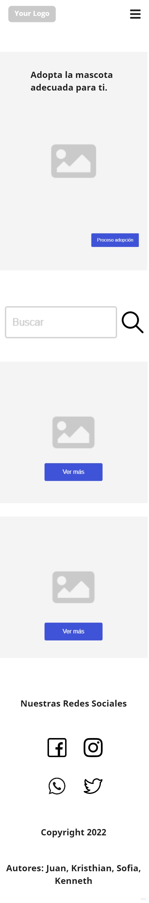

# Adopcion-animales

<h1>Nombre del proyecto. (por definir) </h1>

  <section >
    <h2>¿En que consiste? </h2>
    

        El proyecto consiste en brindar mediante un sitio web dedicado a facilitar la adopción de las mascotas(perros, gatos, conejos, hamster, etc..) brindando una descripción de cada animal (edad, foto, ciudad, tamaño, vacunas, castrado o no, ect..)  para mejorar la calidad de vida en el hogar que le de cariño. 
    

  </section>

  <section>
    <h2>Público objetivo </h2>
    

      El público objetivo al que Adoptame apunta es a cualquier persona que quiera una compañía. Que sea capaz de cuidar de él, que tenga el tiempo suficiente para hacerse cargo. Que cuida el medio ambiente. Que le preocupa la situación de los animales, como los refugios no dan a basto. 
    

    

      Adopta me, está enfocado a los interesados en adoptar que, al ingresar, se encuentran con un catálogo con todos los animales que hay en los refugios prontos para llevarlos, con toda su información y su foto. Aparece la historia de cómo llegó al refugio y cómo ha sido su estadía en él, como para generar un vínculo con el animal. 
    

    

      Una vez que la persona decide adoptar, comienza el proceso en la web respondiendo una serie de preguntas elaboradas por el refugio al que pertenece el animal elegido.Cuando termina ese proceso, le confirmamos que el formulario ya se envió al refugio para que este lo evalúe. Si considera que el solicitante está apto, se hace un segundo contacto y de ahí en más siguen el proceso las dos partes por fuera de la aplicación
    

  </section>

  <section>
    <h2>  Descripción del equipo:</h2>
    <ol>
      <li>-Juan Pablo Acosta: hola chicos soy Juan Pablo Acosta, tengo 24 años, soy de Buenos Aires, Argentina, a mi me gusta hacer ejercicio, jugar videojuegos </li>
      <li> -Kristhian Rojas: Soy Kristhian Rojas, tengo 27 años, vivo en Bogota, Colombia. Soy cordinador logistico. Me gusta manejar cicla, la cocina y los gatos. </li>
      <li> -Sofia Triaca: Soy Sofía Triaca, tengo 26 años y soy de Montevideo, Uruguay.  Soy Licenciada en Diseño Grafico. Me gusta la fotografia y cocinar. Como me gusta seguir aprendiendo y desarollandome en mi carrera. Me entusiasma aprender programación.</li>
      <li>-Kenneth David Leonel: Bueno chicos soy Kenneth David Leonel Triana, tengo 21 años y medio, soy de Bogotá Colombia, si se trata de mis hobbies me gusta escribir poemas, jugar videojuegos, soy muy hogareño, en cuanto a lo demás soy estudiante de ingeniería </li>
     </ol>
  </section>

  <section >
    <h2>Herramientas utilizadas en el proyecto: </h2>
    <ul>
      <li>HTML5 </li>
      <li>CSS3 </li>
      <li>JavaScript </li>
      <li>React </li>
    </ul>

  <section >
       <h2>Listado de referencias para el diseño del proyecto:</h2>
      <ol>
        <li> <a href="https://www.fundaciontepa.org/adopta/">fundación tepa</a>
          
 El diseño del sitio nos aporto una visión amplia sobre la distribución de los topicos a realizar, como lo 
          es el navegador, la opción de adoptar, requisitos para poder adoptar al animalito. 

        </li>
        <li> <a href="https://www.behance.net/gallery/90712891/Pewos-Diseno-de-sitio-de-adopcion-de-perros?tracking_source=search_projects%7Cadopcion"> Pewos</a>
        
 Este diseño nos ayudo a tener una referencia minimalista del aplicativo, una forma responsive del diseño  que podemos acoger. 

        </li>
        <li> <a href="https://www.behance.net/gallery/120218931/Pet-Adoption-Web-Design?tracking_source=search_projects%7Cadoption%20pet"> Pet-Adoption</a>
        
  Una referencia más basica de lo que podriamos incluir. 

        </li>
        <li> <a href="https://www.animalesbog.gov.co/cliff/index.html#amigos">Animales Bogotá </a>
        
  Es una página gubernamental de Colombia especificamente de Bogotá que ayuda a poder facilitar la adopcion de mascotas 

        </li>
        <li> <a href="https://www.animalessinhogar.com.uy/#/">Animales sin hogar</a>
        
  Página de una fundación Uruguaya, referente para paleta de colores o para tener un diseño sencillo y limpio. 

        </li>
      </ol>
  </section>
  
 
 <h2>Tablero de actividades</h2>
 
 
Enlace a miro 
  <a href ="https://miro.com/app/board/uXjVOicEj8o=/"> MIRO</a>
 

 
 <section>
  <h2>Wireframes Iniciales</h2>
  

    
Galería y Home del sitio web

     
    
     
Galería version móvil

    
  

  

    
Detalle de mascota

     
    
     
Detalle de mascota versión móvil

    
  

   

    
Carrito de mascotas 

     
    
     
Carrito de mascotas versión móvil

    
 

 

    
Registrar usuario

     
    
     
Registrar usuario version móvil

    
 
   

  

    
Inicio de sesión del usuario

     
    
     
Inicio de sesión del usuario version móvil

    
 
  
</section>

